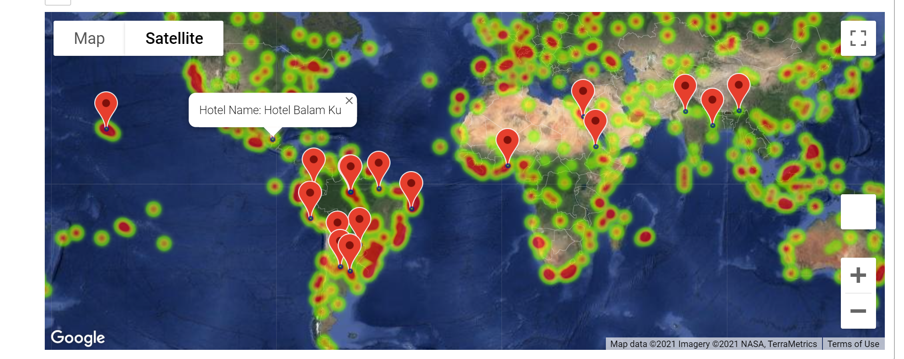

# python-api-challenge

How's the weather up there? Preparing for the weather is key to planning the perfect vacation and we seek to provide you the answers!

In this challenge, we built a Weather API that pulls data from OpenWeatherMap and Google Places and helps users decide on the perfect vacation spot with heat map visualizations and relationship analysis using linear regression
